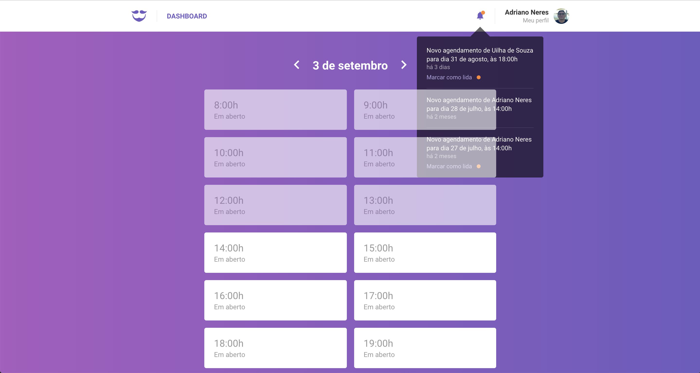

# GoBarber Web

**GoBarber** is a application for barber shop management built in **Node.js**.


It's the backend implementation. To reach the other **GoBarber** projects go to:

- [GoBarber Backend](https://github.com/adrianoneres/gobarber)

- [GoBarber Mobile](https://github.com/adrianoneres/gobarber-mobile)





## Build:

1. Clone **GoBarber**
2. Navigate to the application directory and run `yarn` to make sure you have all the necessary to run it:

```sh
cd gobarber
yarn
```

3. Run the application:

```sh
yarn start
```


